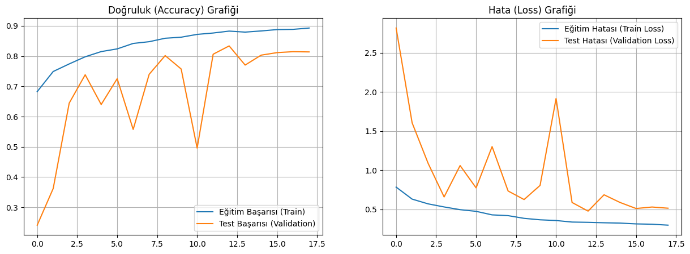
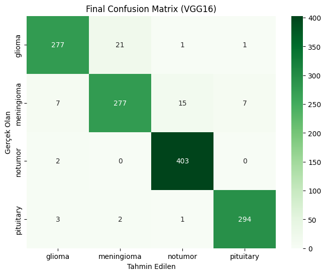
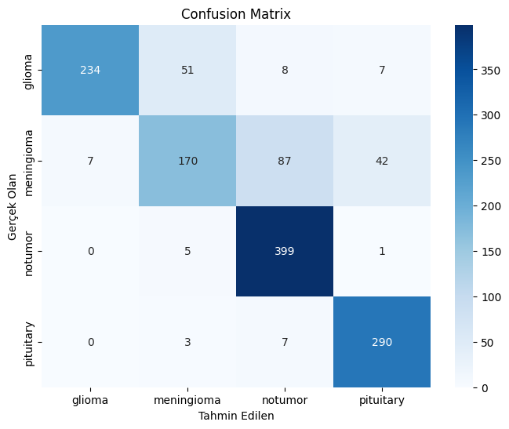

# 🧠 Brain Tumor Detection using CNN & VGG16


## 📌 Project Overview
This project aims to detect and classify brain tumors from Magnetic Resonance Imaging (MRI) scans using Deep Learning techniques. The project implements and compares two different approaches:
1. **Custom CNN:** A custom-built Convolutional Neural Network architecture.
2. **VGG16 (Transfer Learning):** Fine-tuning the pre-trained VGG16 model for medical image classification.

The goal is to assist early diagnosis processes with AI and benchmark the performance (Accuracy/Loss) of different architectures.

## 📂 Dataset
The project utilizes the **Brain Tumor MRI Dataset** from Kaggle. It consists of 4 classes:
* **Glioma Tumor**
* **Meningioma Tumor**
* **Pituitary Tumor**
* **No Tumor**

🔗 [Dataset Link (Kaggle)](https://www.kaggle.com/datasets/masoudnickparvar/brain-tumor-mri-dataset)

## 🛠️ Tech Stack
* **Python 3.10**
* **TensorFlow & Keras:** Model architecture and training.
* **NumPy & Pandas:** Data manipulation.
* **Matplotlib & Seaborn:** Data visualization and plotting results.
* **OpenCV:** Image processing.

## 🚀 Installation & Usage
Follow these steps to run the project locally:

1. **Clone the repository:**
   ```bash
   git clone [https://github.com/mehmetkosee/Brain-Tumor-Detection-Custom-CNN-VGG16.git](https://github.com/mehmetkosee/Brain-Tumor-Detection-Custom-CNN-VGG16.git)
   cd Brain-Tumor-Detection-Custom-CNN-VGG16
Install dependencies:

Bash
pip install -r requirements.txt
Run the Notebook: Open notebooks/brain-tumor-mri-classification-custom-cnn-vgg16.ipynb using Jupyter Notebook or VS Code and execute the cells.

📊 Results
Below are the training performance metrics and the confusion matrix showing the model's classification accuracy.

Training Performance (Loss & Accuracy)


Confusion Matrix
Evaluation of the model's predictions across the 4 tumor classes:




Model Architecture (VGG16 Structure)
👨‍💻 Contact
Developer: Mehmet Köse

GitHub: mehmetkosee

LinkedIn: mehmeet-k0se
